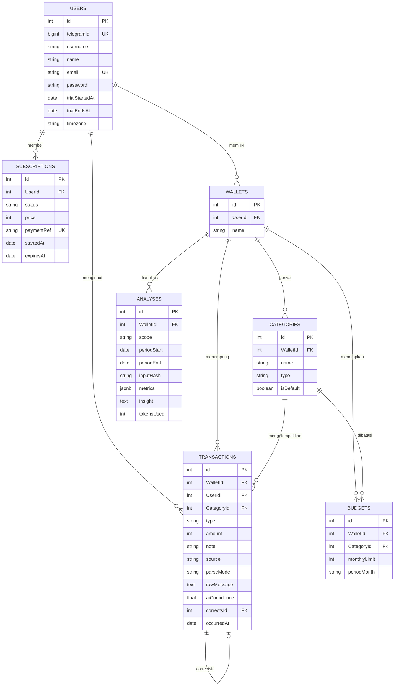

# ERD.md — Relasi Antar Tabel

> Kolom lengkap ada di `ARCHITECTURE.md §2`. File ini menjelaskan **relasi,
> constraint, dan aturan integritas** — hal-hal yang kalau salah, datanya rusak
> pelan-pelan tanpa ketahuan.

---

## 1. Diagram



State konfirmasi tidak ada di diagram ini karena **bukan tabel** — disimpan di
memory dengan TTL 5 menit (`ARCHITECTURE.md §2`).

## 2. Kardinalitas

| Relasi | Kardinalitas | Catatan |
|---|---|---|
| Users → Wallets | 1 : N | v1.0 tiap user punya tepat 1 wallet, dibuat saat `/start` |
| Users → Subscriptions | 1 : N | Riwayat pembelian. Hanya satu boleh `active` |
| Wallets → Categories | 1 : N | Kategori milik wallet, bukan global |
| Wallets → Transactions | 1 : N | `WalletId` wajib |
| Categories → Transactions | 1 : N | Nullable saat masuk, diisi setelah kategorisasi |
| Transactions → Transactions | 1 : 0..1 | `correctsId` untuk koreksi |
| Wallets + Categories → Budgets | 1 : N | Unik per kategori per bulan |

## 3. Constraint yang Wajib Ada di Migration

### Unique
```sql
UNIQUE (Users.telegramId)
UNIQUE (Users.email) WHERE email IS NOT NULL
UNIQUE (Subscriptions.paymentRef) WHERE paymentRef IS NOT NULL
UNIQUE (Categories.WalletId, Categories.name, Categories.type)
UNIQUE (Budgets.WalletId, Budgets.CategoryId, Budgets.periodMonth)
UNIQUE (Analyses.WalletId, Analyses.scope, Analyses.inputHash)

-- Hanya satu subscription aktif per user:
CREATE UNIQUE INDEX one_active_sub
  ON "Subscriptions"("UserId") WHERE status = 'active';
```

### Check
```sql
CHECK (Transactions.amount > 0)
CHECK (Transactions.type IN ('income','expense','correction'))
CHECK (Transactions.type <> 'correction' OR "correctsId" IS NOT NULL)
CHECK (Transactions.parseMode IN ('ai','rule','manual'))
CHECK (Transactions."aiConfidence" IS NULL OR "aiConfidence" BETWEEN 0 AND 1)
CHECK (Budgets."monthlyLimit" >= 0)
CHECK (Budgets."periodMonth" ~ '^[0-9]{4}-[0-9]{2}$')
```

### Index (query yang paling sering dipakai)
```sql
CREATE INDEX ON "Transactions" ("WalletId", "occurredAt" DESC);
CREATE INDEX ON "Transactions" ("WalletId", "CategoryId", "occurredAt");
CREATE INDEX ON "Subscriptions" ("UserId", "status", "expiresAt");
```

### Perilaku ON DELETE
| Foreign key | Perilaku | Kenapa |
|---|---|---|
| `Transactions.WalletId` | `RESTRICT` | Wallet berisi transaksi tidak boleh hilang |
| `Transactions.CategoryId` | `SET NULL` | Hapus kategori tidak boleh menghapus riwayat uang |
| `Budgets.CategoryId` | `CASCADE` | Budget tanpa kategori tidak ada artinya |
| `Analyses.WalletId` | `CASCADE` | Cache, aman dibuang |
| `Subscriptions.UserId` | `RESTRICT` | Jejak pembayaran harus utuh |

## 4. Aturan yang TIDAK Bisa Dijaga Database (jadi wajib ada test-nya)

Ini yang paling sering bocor. Database tidak bisa menahannya, jadi kode dan test
yang harus.

1. **Append-only.** Service tidak pernah `UPDATE` kolom `amount`, `type`, atau
   `WalletId` di `Transactions`. Yang boleh di-update hanya `CategoryId` dan
   `note`, itu pun hanya dari nilai null / hasil AI awal.
2. **Saldo tidak pernah disimpan.** Selalu `SUM` on the fly.
3. **Kategori harus se-wallet dengan transaksi.** `tx.CategoryId` wajib merujuk
   kategori yang `WalletId`-nya sama. DB tidak bisa mengecek ini lewat FK biasa.
4. **Tier tidak pernah disimpan.** Selalu `entitlementService.resolve()`.
5. **Trial sekali seumur hidup.** `trialStartedAt` hanya boleh ditulis kalau masih
   null.
6. **`update_id` Telegram tidak boleh diproses dua kali.**
7. **Satu transaksi hanya boleh dikoreksi sekali.** Koreksi atas transaksi yang
   sudah punya baris `correction` → tolak 400.

## 5. Seed Kategori Default

Dibuat otomatis saat `/start`, semua dengan `isDefault: true`.

**Expense:** Makanan, Transportasi, Belanja, Tagihan, Kesehatan, Hiburan,
Pendidikan, Lainnya
**Income:** Gaji, Bonus, Freelance, Lainnya

Kategori default yang sudah dipakai transaksi tidak boleh dihapus → tolak 400.
Tier `free` selalu masuk ke kategori "Lainnya" karena `ruleParser` tidak
mengkategorikan.

## 6. Contoh Data Setelah Satu Transaksi Masuk

User kirim `makan siang 35rb`, confidence 0.93, tier trial:

```
Users:        { id: 1, telegramId: 123456789, trialEndsAt: '2026-08-31' }
Wallets:      { id: 1, UserId: 1, name: 'Dompet Utama' }
Categories:   { id: 3, WalletId: 1, name: 'Makanan', type: 'expense' }
Transactions: { id: 12, WalletId: 1, UserId: 1, CategoryId: 3,
                type: 'expense', amount: 35000, note: 'makan siang',
                source: 'text', parseMode: 'ai', aiConfidence: 0.93,
                correctsId: null, occurredAt: '2026-08-26' }
Analyses:     { id: 5, WalletId: 1, scope: 'on_transaction',
                inputHash: 'a3f9...', metrics: {...}, insight: 'Makanan...' }
```

User yang sama tapi tier `free` → baris `Transactions` identik kecuali:
`CategoryId: 8` (Lainnya), `parseMode: 'rule'`, `aiConfidence: null`, dan
**tidak ada baris `Analyses` sama sekali**.
